# Modul 4 Jarkom

Rute

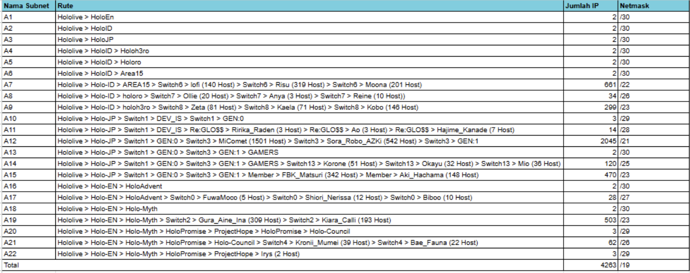

CIDR Menggunakan GNS

Topologi

Subnetting

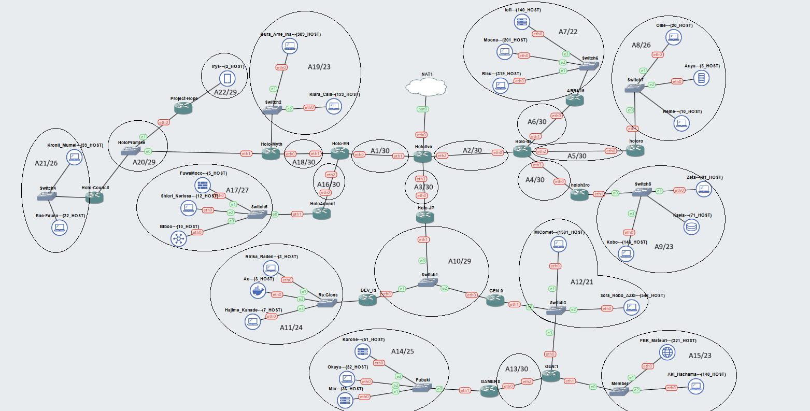

Penggabungan pertama

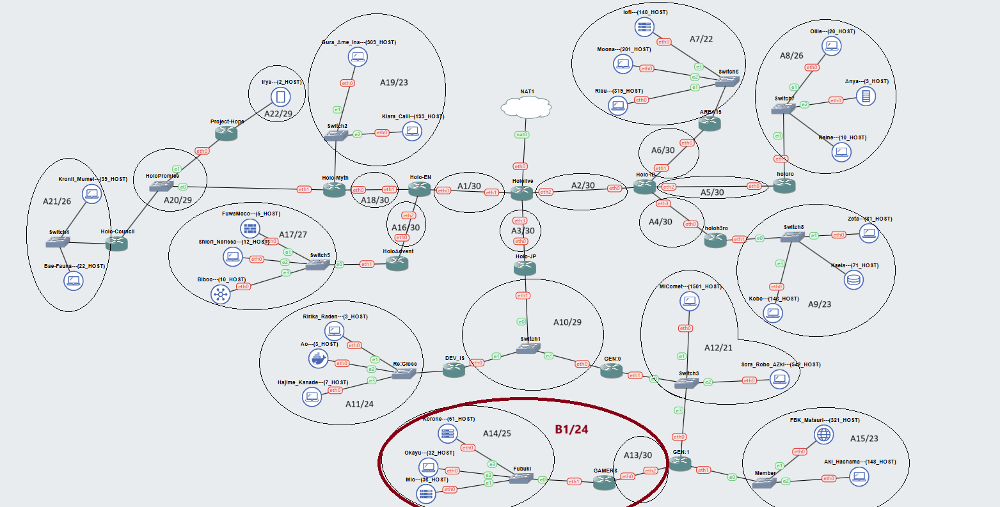

Penggabungan kedua

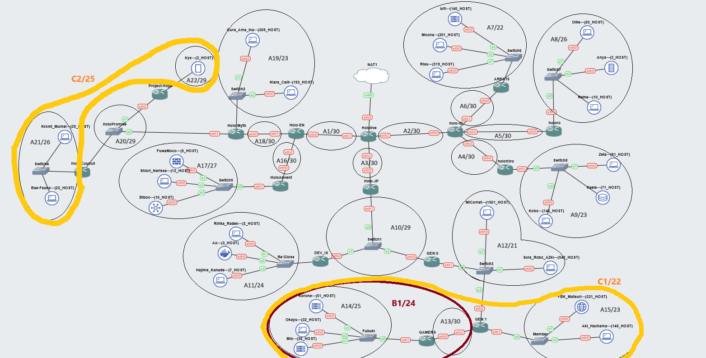

Penggabungan 3

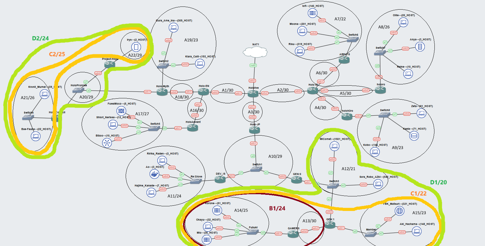

Penggabungan 4

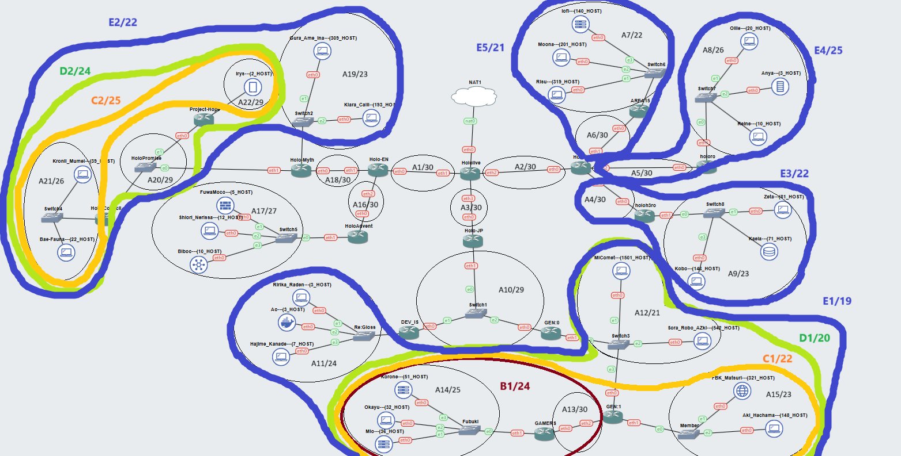

Penggabungan 5

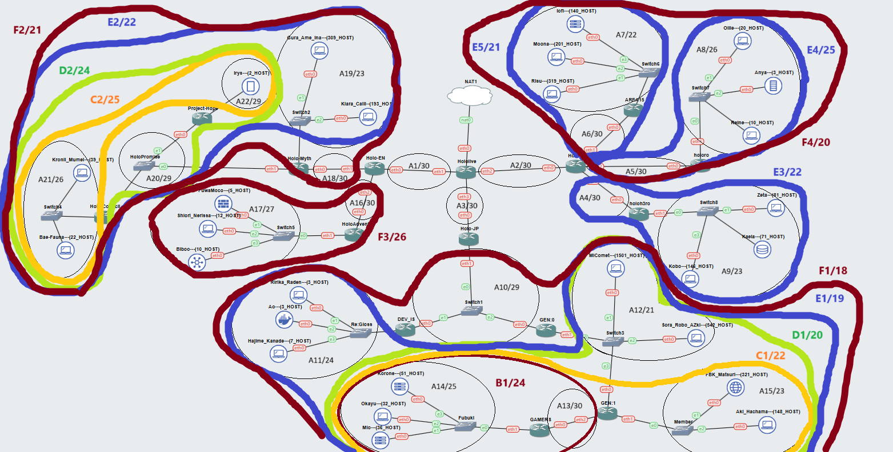

Penggabungan 6

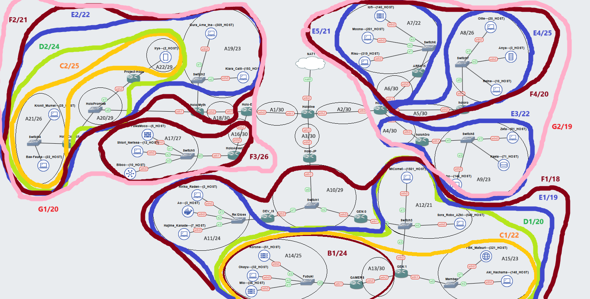

Penggabungan 7

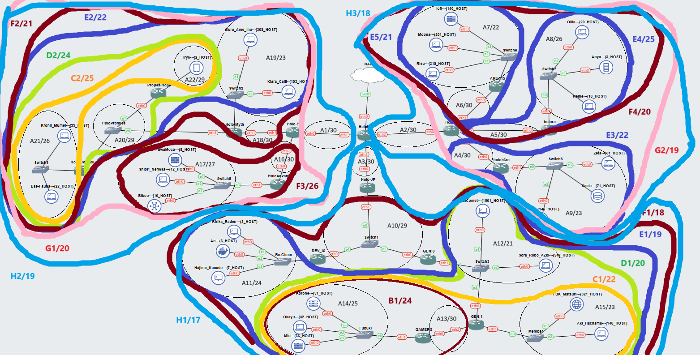

Penggabungan 8

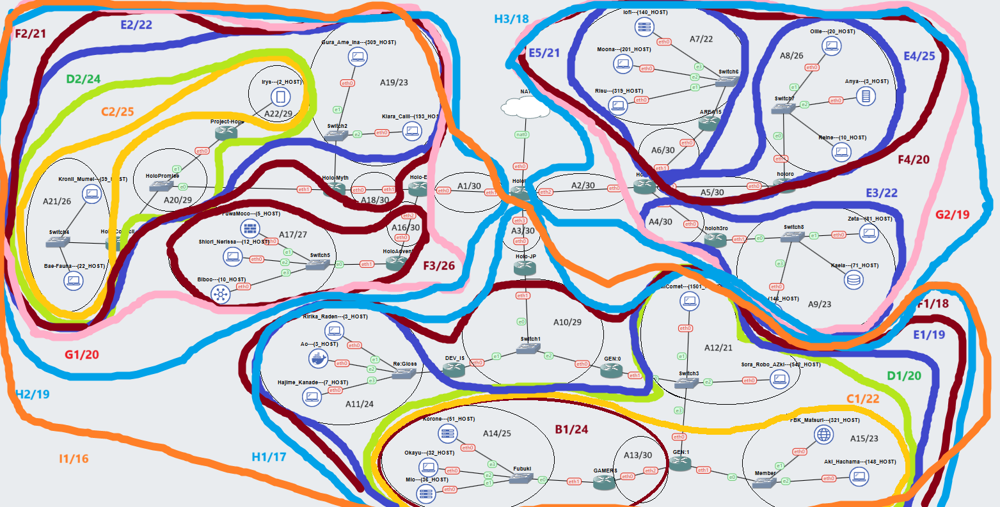

Penggabungan 9

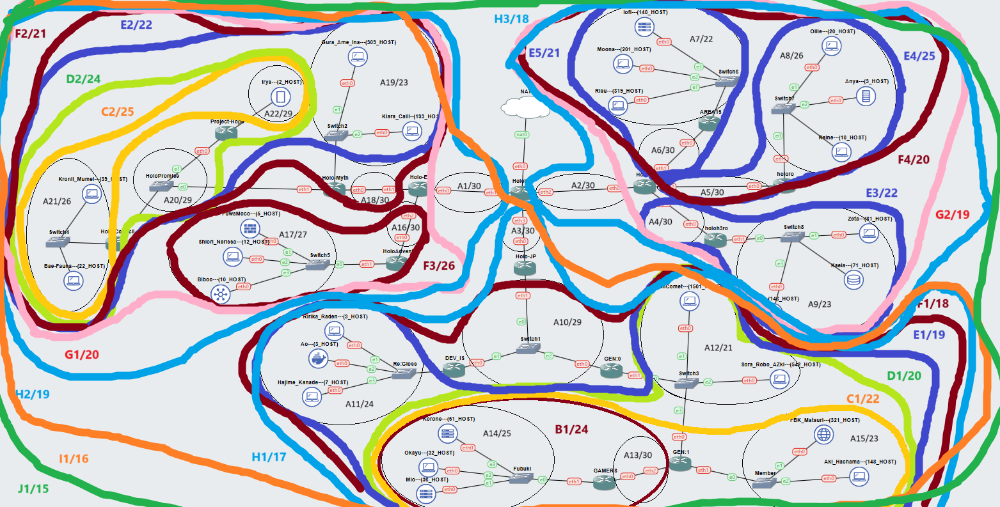

Tree

Pembagian IP

VLSM Menggunakan CPT

Topologi

Tree VLSM

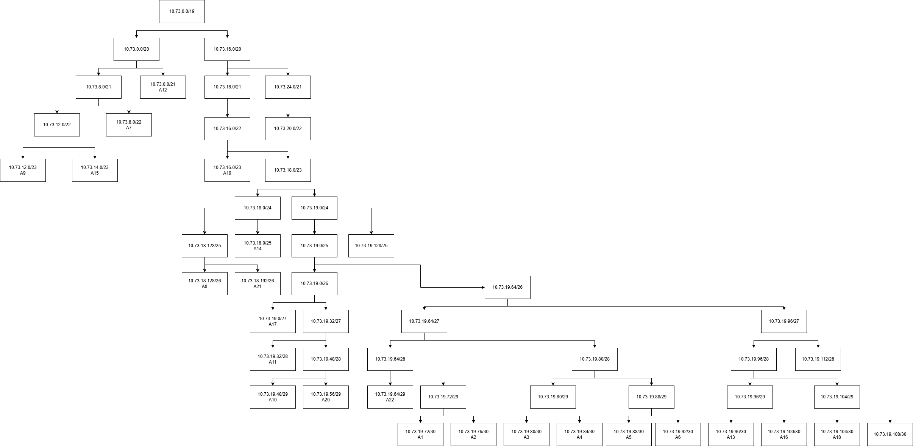

Pembagian IP VLSM

